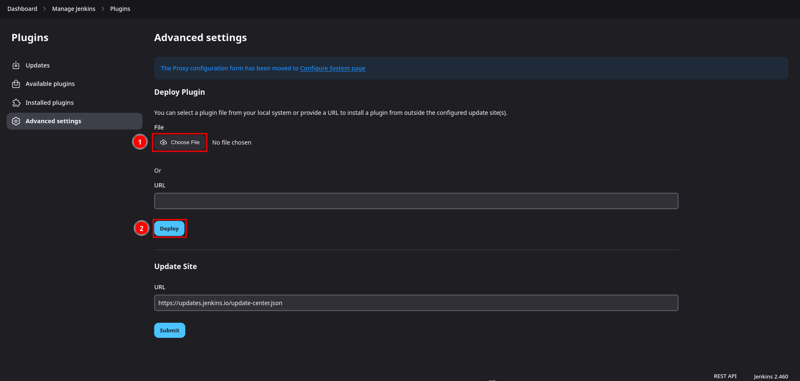

# 2FA for Jenkins
<p align="center">
    
</p>


## Description
This project is a fork of the [jenkinsci/miniorange-two-factor-plugin](https://github.com/jenkinsci/miniorange-two-factor-plugin) with a refactored code base, removed banners and added TOTP Authentication.

**Supported Authentication methods**
- Security Questions
- OTP Over Email
- TOTP Authenticator
- Duo Push Notification [Not implemented yet]
- Yubikey hardware token [Not implemented yet]
- OTP over SMS [Not implemented yet]
- Backup code [Not implemented yet]

**Features of Jenkins 2FA plugin**
- Enable and disable 2FA for all users in a single click
- 2FA supported for all security realms
- Enable 2FA for users in specific groups [Not implemented yet]
- Disable 2FA for users in specific groups [Not implemented yet]


## Getting started

### Prerequisites
- Jenkins ≥ 2.361.4
- [Mailer Plugin](https://plugins.jenkins.io/mailer/)

### Installation

- #### Download plugin 
    - Go to the [Releases page](https://github.com/chekist32/2fa-plugin-jenkins/releases) and download the latests plugin release.

- #### Verify signature (Optional)
    - Import the public signing key.
    ```shell 
    gpg --keyserver keyserver.ubuntu.com --recv-keys EB39AE11A97F961E7F1C97528C65DB4C128B09E9
    ```
    - Download related signature and verify.
    ```shell
    gpg --verify plugin_file_name.hpi.sig
    ```
    You should see something like this:
    ```shell
    $ gpg --verify 2fa-jenkins-plugin-1.0.0.hpi.sig 
    gpg: assuming signed data in '2fa-jenkins-plugin-1.0.0.hpi'
    gpg: Signature made Fri 31 May 2024 08:31:02 PM CEST
    gpg:                using EDDSA key EB39AE11A97F961E7F1C97528C65DB4C128B09E9
    gpg: Good signature from "github-chekist32" [unknown]
    gpg: WARNING: This key is not certified with a trusted signature!
    gpg:          There is no indication that the signature belongs to the owner.
    Primary key fingerprint: EB39 AE11 A97F 961E 7F1C  9752 8C65 DB4C 128B 09E9
    ```
- #### Install plugin
    - Go to **Manage Jenkins** > **Plugins** > **Advanced settings**
    - Click **Choose file** button and upload the .hpi file.
    - Click **Deploy**.
    
    - Reload the Jenkins instance.


## Usage

### Important Note
**A Jenkins instance must have configured https in order to be able to use this plugin.**

### Configure global settings (Admin)
- Go to **Manage Jenkins** > **2FA Global Configurations**


- Enable 2FA for all users


- Choose methods that can be used by users as 2FA


#### Otp Over Email
- Go to **Manage Jenkins** > **Configure System (E-mail Notification section)**


- Here you have to setup the mailer plugin in order to be able to use the Otp Over Email method. You can follow [this guide](https://github.com/jenkinsci/mailer-plugin?tab=readme-ov-file#configuration).


### Configure specific 2FA Method (User)
- Go to **User profile** > **2FA Configuration**


- Here you can configure or reset 2FA methods enabled in global settings

