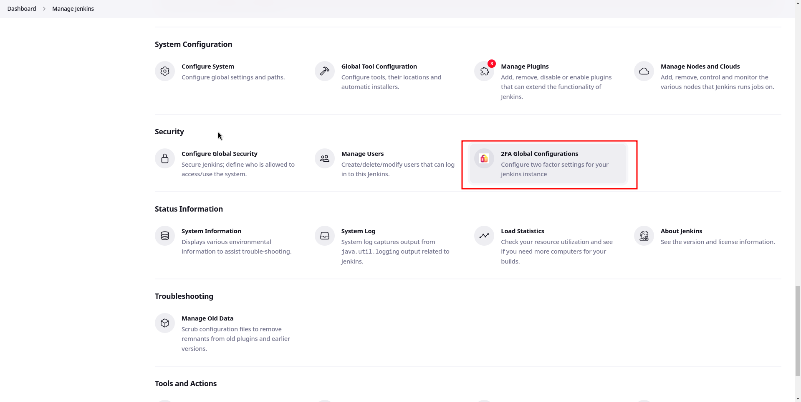
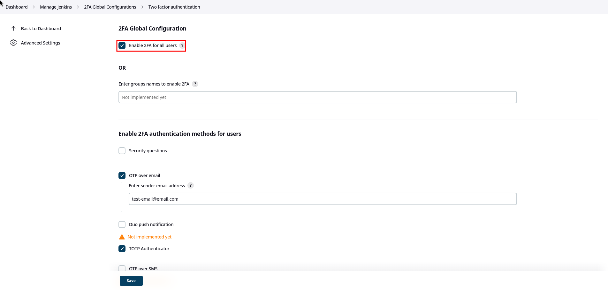
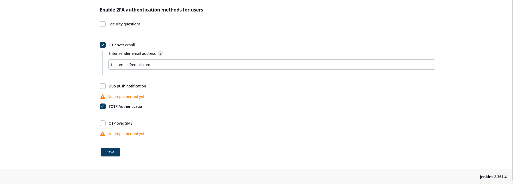
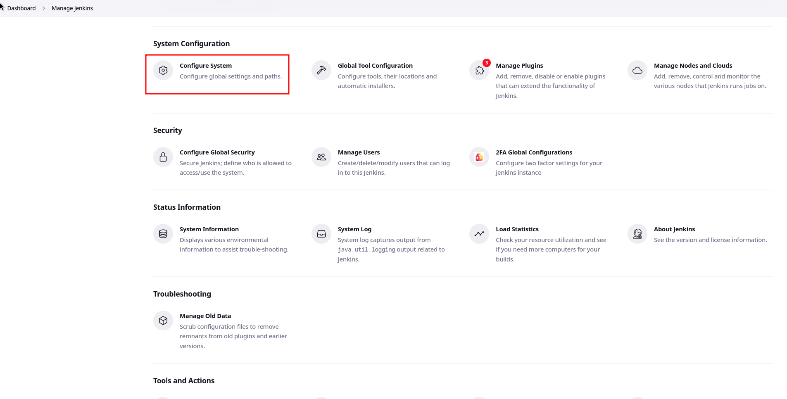
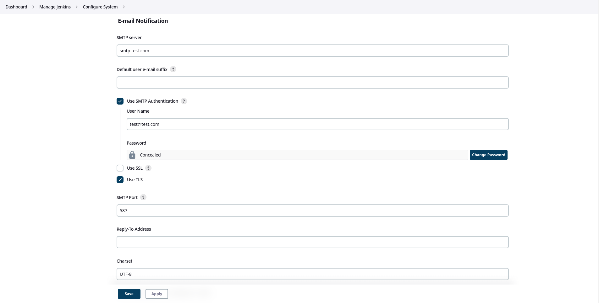
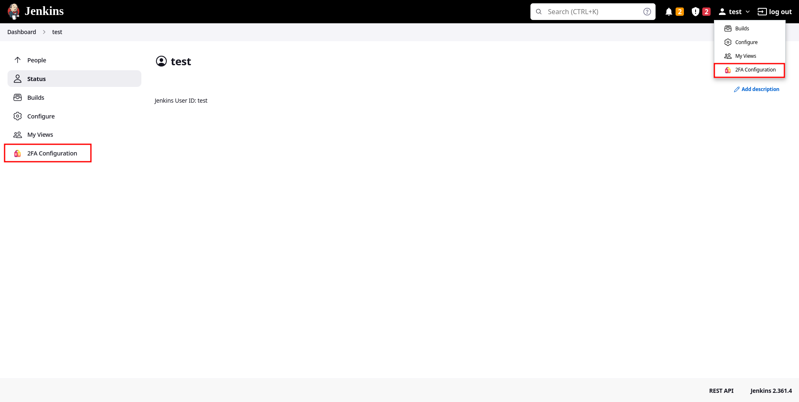
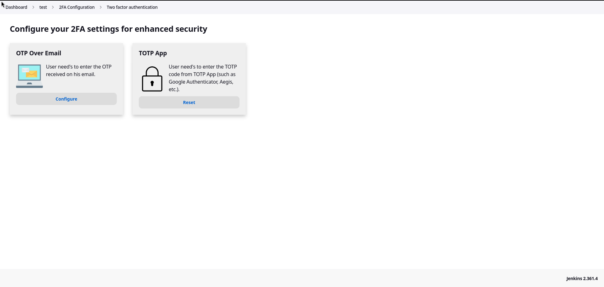

# 2FA for Jenkins

    

## Description
This project is just a fork of the [jenkinsci/miniorange-two-factor-plugin](https://github.com/jenkinsci/miniorange-two-factor-plugin) with a slightly refactored code base and added TOTP Authentication.

**Supported Authentication methods**
- Security Questions
- OTP Over Email
- TOTP Authenticator
- Duo Push Notification [Not implemented yet]
- Yubikey hardware token [Not implemented yet]
- OTP over SMS [Not implemented yet]
- Backup code [Not implemented yet]

**Features of Jenkins 2FA plugin**
- Enable and disable 2FA for all users in a single click
- 2FA supported for all security realms
- Enable 2FA for users in specific groups [Not implemented yet]
- Disable 2FA for users in specific groups [Not implemented yet]

## How to start

### Important Note
**A Jenkins instance must have configured https in order to be able to use this plugin.**

### Configure global settings (Admin)
- Go to **Manage Jenkins** > **2FA Global Configurations**

- Enable 2FA for all users

- Choose methods that can be used by users as 2FA

#### Otp Over Email
- Go to **Manage Jenkins** > **Configure System (E-mail Notification section)**

- Here you have to setup the mailer plugin in order to be able to use the Otp Over Email method. You can follow [this guide](https://github.com/jenkinsci/mailer-plugin?tab=readme-ov-file#configuration).

### Configure specific 2FA Method (User)
- Go to **User profile** > **2FA Configuration**

- Here you can configure or reset 2FA methods enabled in global settings

